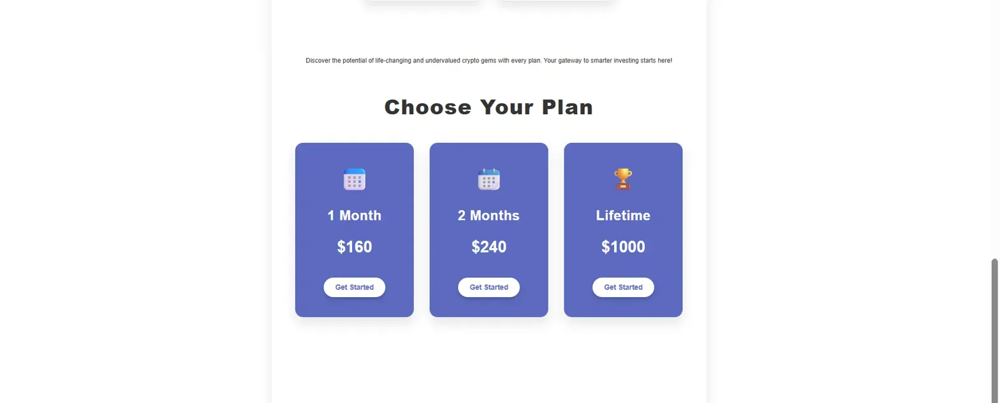
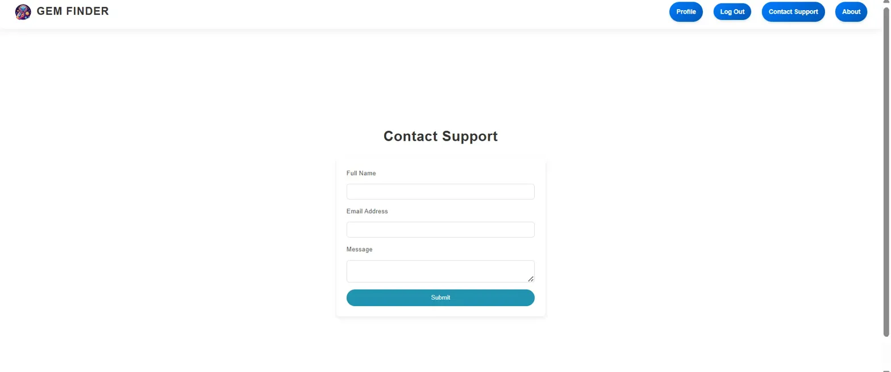

# Gem Finder - Cryptocurrency Signal Platform

A full-stack web application for cryptocurrency investment insights and signals. Users can subscribe to premium cryptocurrency analysis, track live prices, and access exclusive investment recommendations through a subscription-based model.

## Technology Stack

**Frontend:**
- React.js
- JavaScript (ES6+)
- CSS3
- HTML5

**Backend:**
- Node.js
- Express.js
- Firebase (Authentication & Database)

**APIs & Services:**
- Stripe API - Payment processing and subscription management
- CoinGecko API - Real-time cryptocurrency price tracking (BTC, ETH, SOL)
- EmailJS API - Contact support and email notifications

**Authentication:**
- Firebase Authentication

**Database:**
- Firebase Firestore

## Features Overview

### Cryptocurrency Price Tracking
- Real-time price updates for Bitcoin (BTC), Ethereum (ETH), and Solana (SOL)
- Live percentage change indicators
- Integration with CoinGecko API for accurate market data

### Subscription Management
- Multiple subscription tiers (1 Month, 2 Months, Lifetime)
- Secure payment processing through Stripe
- User authentication and authorization
- Subscription status tracking

### Investment Signals
- AI Coins analysis and recommendations
- Gaming Coins insights
- RWA (Real World Assets) Coins tracking
- Success stories and case studies

### User Authentication
- Secure sign-up and login system
- Firebase-based authentication
- Protected routes for subscribers
- User profile management

### Contact Support
- Integrated contact form using EmailJS
- Direct support communication
- User inquiry management

### Educational Content
- Cryptocurrency basics and guides
- Investment strategy information
- Market analysis and insights

## Screenshots

### Homepage


Landing page featuring live cryptocurrency prices and subscription call-to-action with real-time BTC, ETH, and SOL tracking.

### Why Choose Us


Platform features including community support, gem finder mission, advanced chart analysis, entry/exit strategies, and full customer support.

### Subscription Plans


Three subscription tiers with clear pricing: 1 Month ($160), 2 Months ($240), and Lifetime ($1000).

### Contact Support


User-friendly contact form for support inquiries with full name, email address, and message fields.

## Installation & Setup

### Prerequisites
- Node.js 14.x or higher
- npm or yarn package manager
- Firebase account
- Stripe account
- CoinGecko API access (free tier available)
- EmailJS account

### Steps

1. **Clone the repository**
```bash
   git clone https://github.com/Rafat-i/gem-finder.git
   cd gem-finder
```

2. **Install dependencies**
```bash
   # Install backend dependencies
   cd backend
   npm install

   # Install frontend dependencies
   cd ..
   npm install
```

3. **Configure Firebase**
   - Create a Firebase project at [Firebase Console](https://console.firebase.google.com/)
   - Enable Authentication (Email/Password)
   - Create a Firestore database
   - Copy your Firebase configuration
   - Create a `Firebase.js` file in `src/` and add your config:
```javascript
     import { initializeApp } from 'firebase/app';
     import { getAuth } from 'firebase/auth';
     import { getFirestore } from 'firebase/firestore';

     const firebaseConfig = {
       apiKey: "your-api-key",
       authDomain: "your-auth-domain",
       projectId: "your-project-id",
       storageBucket: "your-storage-bucket",
       messagingSenderId: "your-messaging-sender-id",
       appId: "your-app-id"
     };

     const app = initializeApp(firebaseConfig);
     export const auth = getAuth(app);
     export const db = getFirestore(app);
```

4. **Configure Stripe**
   - Create a Stripe account at [Stripe](https://stripe.com/)
   - Get your API keys from the Dashboard
   - Create a `.env` file in the backend directory:
```
     STRIPE_SECRET_KEY=your_stripe_secret_key
     STRIPE_PUBLISHABLE_KEY=your_stripe_publishable_key
```
   - Add your Stripe publishable key to the frontend environment

5. **Configure EmailJS**
   - Create an EmailJS account at [EmailJS](https://www.emailjs.com/)
   - Set up an email service and template
   - Add your credentials to the contact form component:
```javascript
     emailjs.send(
       'your_service_id',
       'your_template_id',
       templateParams,
       'your_public_key'
     );
```

6. **Start the development servers**
```bash
   # Start backend server
   cd backend
   npm start

   # In a new terminal, start frontend
   cd ..
   npm start
```

7. **Access the application**
```
   Frontend: http://localhost:3000
   Backend: http://localhost:5000
```

## Project Structure
```
gem-finder/
├── backend/
│   ├── node_modules/
│   ├── public/
│   ├── package-lock.json
│   ├── package.json
│   └── server.js              # Express server & API routes
├── src/
│   ├── components/            # React components
│   │   ├── Admin/
│   │   │   ├── AddUser.js
│   │   │   ├── AddUser.css
│   │   │   ├── AdminDashboard.js
│   │   │   ├── AdminDashboard.css
│   │   │   ├── RemoveUser.js
│   │   │   ├── RemoveUser.css
│   │   │   ├── UpdateUsers.js
│   │   │   ├── UpdateUsers.css
│   │   │   ├── ViewUsers.js
│   │   │   └── ViewUsers.css
│   │   ├── About.js
│   │   ├── About.css
│   │   ├── AiCoins.js
│   │   ├── AiCoins.css
│   │   ├── AuthStateListener.js
│   │   ├── Cancel.js
│   │   ├── Cancel.css
│   │   ├── ContactSupport.js
│   │   ├── ContactSupport.css
│   │   ├── GamingCoins.js
│   │   ├── GamingCoins.css
│   │   ├── Header.js
│   │   ├── Header.css
│   │   ├── Home.js
│   │   ├── Home.css
│   │   ├── Layout.js
│   │   ├── Layout.css
│   │   ├── Login.js
│   │   ├── PasswordRecovery.js
│   │   ├── PaymentForm.js
│   │   ├── PaymentPage.js
│   │   ├── ProfileEdit.js
│   │   ├── RwaCoins.js
│   │   ├── RwaCoins.css
│   │   ├── SideNavBar.js
│   │   ├── SideNavBar.css
│   │   ├── SignUp.js
│   │   ├── Success.js
│   │   ├── Success.css
│   │   ├── SuccessStories.js
│   │   └── SuccessStories.css
│   ├── context/
│   │   └── Image/             # Image assets
│   │       ├── BackgroundImage.jpg
│   │       ├── binance.png
│   │       ├── coinbase.png
│   │       ├── CryptoLogo.jpg
│   │       ├── ghx.png
│   │       ├── ghxBoughtPrice.png
│   │       ├── ghxSoldPrice.png
│   │       ├── kraken.png
│   │       ├── ledger.png
│   │       ├── metamask.png
│   │       ├── RightImage.jpg
│   │       ├── RightLogo.jpg
│   │       ├── rio.png
│   │       ├── rioBoughtPrice.png
│   │       ├── rioSoldPrice.png
│   │       ├── tao.png
│   │       ├── taoBoughtPrice.png
│   │       ├── taoSoldPrice.png
│   │       └── uniswap.png
│   ├── routes/
│   │   ├── AdminRoute.js
│   │   └── ProtectedRoute.js
│   ├── App.js                 # Main application component
│   ├── App.test.js
│   ├── App.css
│   ├── Firebase.js            # Firebase configuration
│   ├── index.js               # Application entry point
│   ├── index.css
│   ├── logo.svg
│   ├── reportWebVitals.js
│   └── setupTests.js
├── screenshots/               # Application screenshots
│   ├── homepage.png
│   ├── why-choose-us.png
│   ├── subscription-plans.png
│   └── contact-support.png
├── .gitignore
├── package-lock.json
├── package.json
└── README.md
```

## Key Components

### Authentication Flow
- User registration with email verification
- Secure login system
- Password recovery functionality
- Protected routes for authenticated users

### Subscription System
- Integration with Stripe for payment processing
- Subscription tier management
- User subscription status tracking
- Automatic access control based on subscription

### Live Price Tracking
- CoinGecko API integration
- Real-time price updates
- Percentage change calculations
- Support for multiple cryptocurrencies

### Admin Dashboard
- User management (Add, Update, Remove, View)
- Subscription monitoring
- System administration tools

## API Endpoints

### Authentication
- `POST /api/auth/signup` - User registration
- `POST /api/auth/login` - User login
- `POST /api/auth/logout` - User logout

### Subscriptions
- `POST /api/subscription/create` - Create subscription
- `GET /api/subscription/status` - Check subscription status
- `POST /api/subscription/cancel` - Cancel subscription

### Prices
- `GET /api/prices/live` - Get live cryptocurrency prices

### Contact
- `POST /api/contact` - Submit contact form

## Environment Variables

Create `.env` files in both frontend and backend directories:

**Backend (.env):**
```
PORT=5000
STRIPE_SECRET_KEY=your_stripe_secret_key
FIREBASE_SERVICE_ACCOUNT=your_firebase_service_account_json
NODE_ENV=development
```

**Frontend (.env):**
```
REACT_APP_STRIPE_PUBLISHABLE_KEY=your_stripe_publishable_key
REACT_APP_EMAILJS_SERVICE_ID=your_emailjs_service_id
REACT_APP_EMAILJS_TEMPLATE_ID=your_emailjs_template_id
REACT_APP_EMAILJS_PUBLIC_KEY=your_emailjs_public_key
```

## Usage

### For Users
1. Sign up for an account
2. Browse available cryptocurrency signals
3. Choose a subscription plan (1 Month, 2 Months, or Lifetime)
4. Complete payment through Stripe
5. Access premium content and signals
6. Track live cryptocurrency prices on the homepage

### For Admins
1. Log in with admin credentials
2. Access admin dashboard
3. Manage users and subscriptions
4. Monitor system activity

## Security Features

- Firebase Authentication for secure user management
- Protected API routes
- Stripe secure payment processing
- Environment variable protection
- Input validation and sanitization

## Future Improvements

### Features
- Mobile application (React Native)
- Advanced charting and technical analysis
- Portfolio tracking
- Price alerts and notifications
- Social features (community discussions)
- Multi-language support

### Technical
- WebSocket integration for real-time updates
- Advanced caching strategies
- Server-side rendering (Next.js)
- GraphQL API
- Automated testing suite
- Performance optimization
- Analytics integration

### Business
- Referral program
- Affiliate system
- Additional payment methods
- Corporate/Team subscriptions
- API access for developers

**Disclaimer:** This platform doess not provides cryptocurrency investment insights and it is only for educational purposes. Cryptocurrency investments carry risk. Always do your own research and invest responsibly.